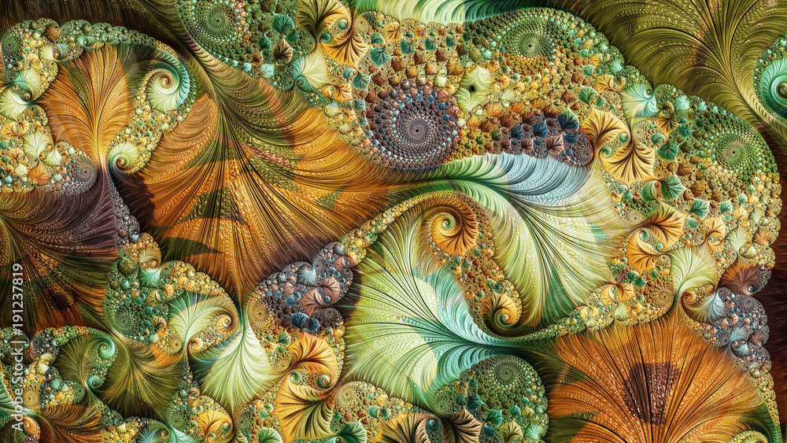
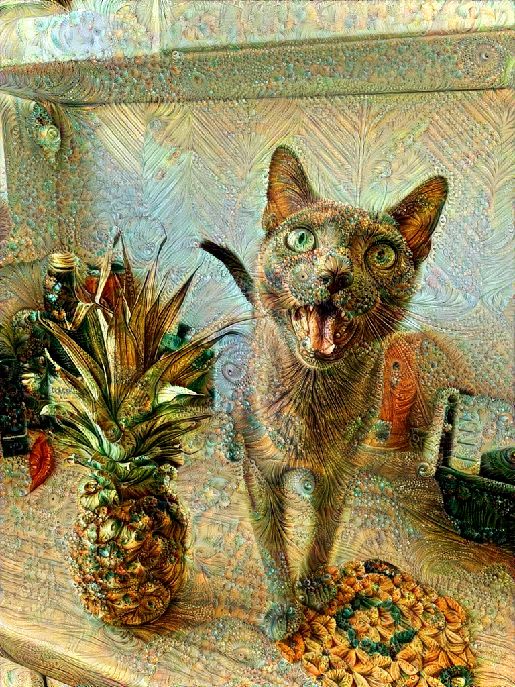

# Neural Style Transfer App
This app uses Neural Style Transfer to combine a content image with the artistic style of another image, creating a unique stylized result. The app uses the VGG19 model, pre-trained on a large image dataset, where intermediate layers act as feature detectors. For content cost it uses the block5_conv2 activation layer, capturing complex features of the content image. For style cost, it employs 10 different sets of layers, ranging from low-level features (Style_1) to more complex features (Style_10). Users can experiment with these different styles, with Style_9 often producing particularly good results.

# Here is an example of the neural style transfer process:

### Content image


### Style image


### Generated result


## How to run the app?

1. Build the Docker image:
docker build -t streamlit-style-transfer . 

2. Run the Docker container:
docker run -it --gpus all -p 8501:8501 streamlit-style-transfer

3. Open your web browser and navigate to:
http://localhost:8501/

Once the app is running, set the content and style images by uploading local images or providing URLs. Adjust the number of iterations and select the style layer set using the provided sliders to see different stylized results.

Tips for Managing GPU Memory Usage:

If you encounter GPU memory limitations, consider decreasing the target_size variable from its default value of 1024 to a lower value, such as 512 or 256. This will reduce the resolution of the images being processed, thereby lowering the memory requirements.

Alternatively, you can select more shallow layers for the style cost calculation. Lower-level layers (e.g., Style_1 or Style_2) require less computational power and memory compared to deeper layers

By following these tips, you can adjust the app to better fit the capabilities of your GPU, ensuring smoother and more efficient performances
